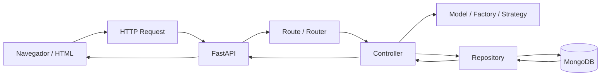

# ⚽ Fantasy League Simulator

Simulador de Liga de Fútbol Fantasy — Proyecto final de **Programación
Orientada a Objetos (POO)**. Los usuarios crean equipos, fichan jugadores
y compiten según los puntos generados al simular partidos.

**Stack:** Python + FastAPI + MongoDB (Motor).

---

## Funcionalidades

- Crear/consultar/actualizar/eliminar **jugadores** (Portero, Defensa,
  Medio, Delantero).
- Crear/consultar/actualizar/eliminar **usuarios** (Cliente, Administrador).
- Crear **equipos fantasy** y fichar jugadores (mercado de fichajes).
- Registrar un **partido finalizado** → calcula automáticamente el
  rendimiento de cada jugador y actualiza los puntos de los equipos
  fantasy que lo tengan fichado.

---

## Diseño orientado a objetos

**Herencia**
```
Jugador → Portero | Defensa | Medio | Delantero
Usuarios → Cliente | Administrador
EstadisticasStrategy → EstadisticasPortero | EstadisticasDefensa | EstadisticasMedio | EstadisticasDelantero
```

**Polimorfismo:** cada posición sobreescribe `calcular_puntos()` con su
propia fórmula de puntuación (`estadisticas.calcular_puntos()`).

**Encapsulamiento:** atributos sensibles del modelo (`id`, `puntos`,
`contraseña`, `token`, estadísticas) protegidos como privados (`__atributo`)
y expuestos solo mediante métodos como `to_dict()`.

**Relaciones entre clases:** `Partido` agrega los `Rendimiento` generados;
`EquipoFantasy` agrega jugadores fichados; `Rendimiento` se compone de una
`EstadisticasStrategy`; los `Controllers` dependen de los `Repository`.

**Patrones de diseño:**

| Patrón | Ubicación | Uso |
|---|---|---|
| Singleton | `config/database.py` | Única conexión activa a MongoDB |
| Factory | `models/factory_jugador.py`, `usuario_factory.py`, `factory_estadisticas.py` | Crea el tipo correcto de jugador/usuario/estadística |
| Strategy | `models/estadisticas_strategy.py` + implementaciones | Algoritmo de puntuación intercambiable por posición |
| Observer | `models/observer.py`, `partido_notifier.py`, `controllers/*_controlador.py` | Propaga puntos a jugadores y equipos tras un partido |

---

## Estructura del proyecto

```
src/
├── run.py                  # Punto de entrada (FastAPI)
├── requirements            # Dependencias
├── static/                 # Frontend estático
└── app/
    ├── config/              # Conexión a BD (Singleton) y settings
    ├── models/              # Entidades + Factory/Strategy/Observer
    ├── controllers/         # Lógica de negocio
    ├── repository/          # Acceso a datos (MongoDB)
    └── routes/              # Endpoints FastAPI
```

---

## Flujo general de la aplicación



---

## Requisitos

- Python 3.11+
- MongoDB (local o Atlas)

---

## Instalación y ejecución

```bash
# 1. Clonar
git clone https://github.com/<usuario>/<repositorio>.git
cd <repositorio>

# 2. Entorno virtual
python -m venv venv
source venv/bin/activate      # Windows: venv\Scripts\activate

# 3. Dependencias
pip install -r src/requirements
```

Crear el archivo `src/.env` con la cadena de conexión a MongoDB:

```env
MONGO_URI=mongodb+srv://<usuario>:<contraseña>@<cluster>.mongodb.net/
```

Ejecutar el servidor:

```bash
cd src
uvicorn run:app --reload
```

- App: `http://127.0.0.1:8000`
- Swagger (docs interactivas): `http://127.0.0.1:8000/docs`

---

## Documentación del código

Todas las clases, métodos y funciones cuentan con docstrings (Google Style).
Se puede generar documentación navegable con:

```bash
python -m pydoc -w app.models.jugador app.controllers.jugador_controlador
```

---

## Diagrama UML

```mermaid
classDiagram
%% ===================== USUARIOS =====================
class Usuarios {
  <<abstract>>
  #_nombre : str
  #_email : str
  #_contrasena : str
  +to_dict() dict
  +iniciar_sesion(email, contrasena) bool
  +cambiar_contrasena(nueva_contrasena)
}
class Cliente {
  -__nombre_usuario : str
  -__puntos_totales : dict
  -__equipos : list
  -__token : str
  +to_dict() dict
}
class Administrador {
  -__token : str
  +to_dict() dict
}
Usuarios <|-- Cliente
Usuarios <|-- Administrador

%% ===================== JUGADOR =====================
class Jugador {
  <<abstract>>
  -__id : str
  -__nombre : str
  -__equipo : str
  -__numero_camiseta : str
  -__precio : float
  -__puntos_jugador : float
  -__activo : bool
  -__tarjetas : dict
  -__goles : int
  -__asistencias : int
  +to_dict() dict
}
class Portero {
  -__porteria_cero : int
  -__atajadas : int
  +to_dict() dict
}
class Defensa {
  -__porteria_cero : int
  +to_dict() dict
}
class Medio {
  +to_dict() dict
}
class Delantero {
  +to_dict() dict
}
Jugador <|-- Portero
Jugador <|-- Defensa
Jugador <|-- Medio
Jugador <|-- Delantero

%% ===================== STRATEGY (estadisticas) =====================
class EstadisticasStrategy {
  <<interface>>
  +calcular_puntos() float
  +obtener_estadisticas() dict
}
class EstadisticasPortero {
  -__atajadas : int
  -__goles_en_contra : int
  +calcular_puntos() float
}
class EstadisticasDefensa {
  -__pases_completados : int
  -__goles_en_contra : int
  +calcular_puntos() float
}
class EstadisticasMedio {
  -__pases_completados : int
  -__tiros_a_puerta : int
  +calcular_puntos() float
}
class EstadisticasDelantero {
  -__tiros_a_puerta : int
  +calcular_puntos() float
}
EstadisticasStrategy <|.. EstadisticasPortero
EstadisticasStrategy <|.. EstadisticasDefensa
EstadisticasStrategy <|.. EstadisticasMedio
EstadisticasStrategy <|.. EstadisticasDelantero

%% ===================== RENDIMIENTO / PARTIDO =====================
class Rendimiento {
  -__jugador_id : str
  -__partido_id : str
  -__strategy : EstadisticasStrategy
  -__puntos : float
  +calcular_puntos()
  +obtener_puntos() float
  +to_dict() dict
}
class Partido {
  -__id : str
  -__fecha : str
  -__equipo_local : str
  -__equipo_visitante : str
  -__ID_rendimiento : list
  +agregar_ID_rendimiento(id_rendimiento)
  +to_dict() dict
}
class EquipoFantasy {
  -__id_usuario : str
  -__nombre_equipo : str
  -__jugadores_en_equipo : dict
  -__puntos : int
  +agregar_jugador(jugador_id)
  +calcular_puntos()
  +to_dict() dict
}

Rendimiento o-- EstadisticasStrategy : usa (Strategy)
Partido "1" o-- "0..*" Rendimiento : genera
Cliente "1" o-- "0..*" EquipoFantasy : posee
EquipoFantasy "0..*" --> "0..*" Jugador : ficha (por id)

%% ===================== OBSERVER =====================
class Observer {
  <<interface>>
  +actualizar(datos_partido) async
}
class PartidoNotifier {
  #_observers : List~Observer~
  +attach(observer)
  +notify(partido_info) async
}
class PartidoControladorNotifier {
  +notificar(estadisticas_partido) async
}
class PuntosJugadorControlador {
  +actualizar(jugador_info) async
}
class PuntosEquipoControlador {
  +actualizar(jugador_info) async
}

PartidoNotifier <|-- PartidoControladorNotifier
Observer <|.. PuntosJugadorControlador
Observer <|.. PuntosEquipoControlador
PartidoNotifier "1" o-- "0..*" Observer : notifica a

%% ===================== FACTORY =====================
class jugador_factory {
  <<Factory>>
  +jugador_factory(doc) Jugador
}
class usuario_factory {
  <<Factory>>
  +usuario_factory(doc) Usuarios
}
class factory_estadisticas {
  <<Factory>>
  +factory_estadisticas(posicion, doc) EstadisticasStrategy
}

jugador_factory ..> Jugador : crea
usuario_factory ..> Usuarios : crea
factory_estadisticas ..> EstadisticasStrategy : crea

%% ===================== PERSISTENCIA (Repository + Singleton) =====================
class MongoDBConnection {
  <<Singleton>>
  -client : AsyncIOMotorClient
  -db : AsyncIOMotorDatabase
  +get_db() AsyncIOMotorDatabase
}

class JugadorRepository {
  -collection : Collection
  +obtener_por_nombre(nombre)
}
class PartidoRepository {
  -collection : Collection
}
class UsuarioRepository {
  -collection : Collection
  +obtener_por_correo(correo)
}
class EquipoRepository {
  -collection : Collection
  +actualizar_varios_equipos(jugador_id, puntos)
}
class RendimientoRepository {
  -collection : Collection
  +obtener_todos_por_jugador_id(jugador_id)
}

note for JugadorRepository "Todos los Repository implementan\nel mismo CRUD base:\ncrear() · obtener_por_id() · obtener_todos()\nactualizar() · eliminar()"

JugadorRepository --> MongoDBConnection : usa
PartidoRepository --> MongoDBConnection : usa
UsuarioRepository --> MongoDBConnection : usa
EquipoRepository --> MongoDBConnection : usa
RendimientoRepository --> MongoDBConnection : usa

```



---

## Autores

- Jhostin Avendaño Herrera
- Carlos Samuel Gutierrez Olejua
- Diego Armando Ruiz Landero
